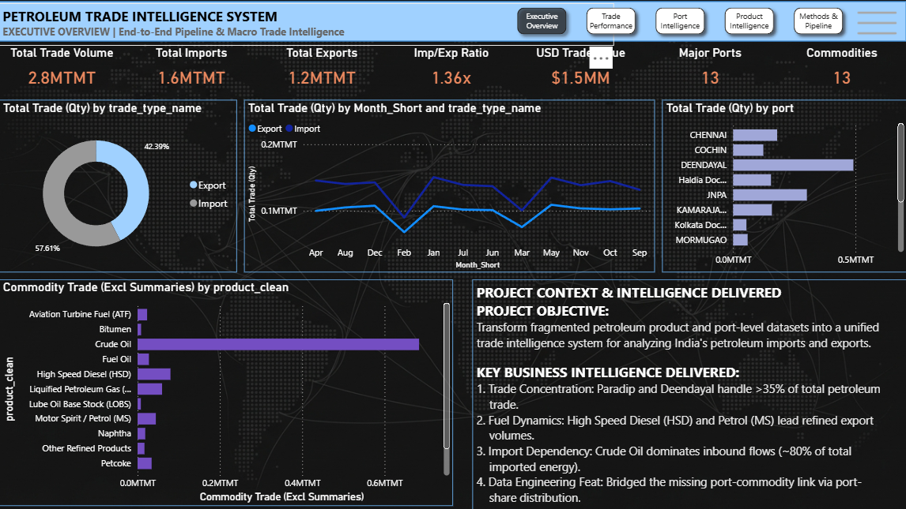
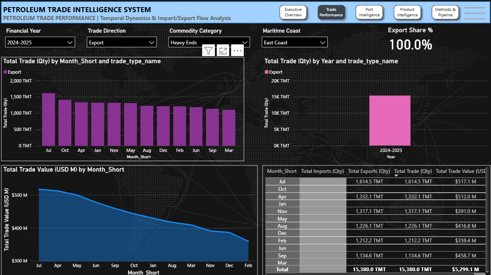
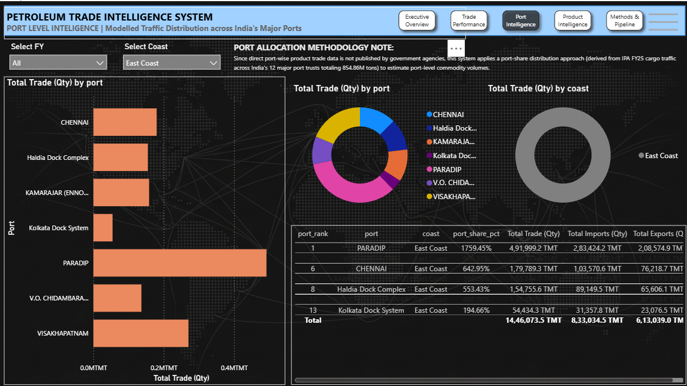
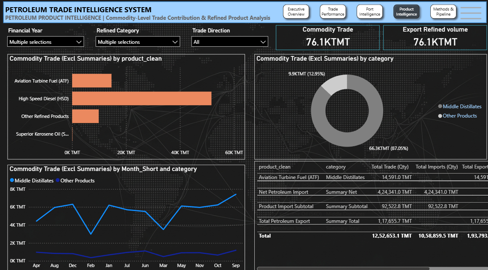
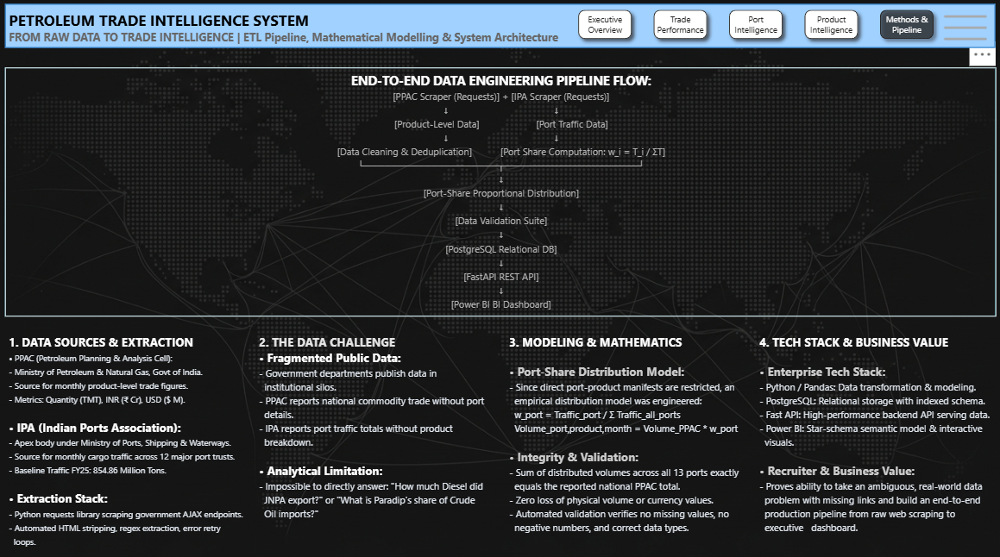

#  Petroleum Trade Intelligence System

##  Overview
This project is an end-to-end Data Engineering + Analytics Pipeline built to analyze India’s petroleum import/export trade across ports.

It integrates:
- Data Scraping (PPAC, IPA)
- Data Cleaning & Transformation
- Data Merging & Modeling
- PostgreSQL Database
- FastAPI Backend
- Power BI Dashboard

---

##  Objective
Government data is available separately:
- PPAC → Product-level trade data  
- IPA → Port-level traffic data  

No direct port-wise product dataset is available.

This project builds a complete pipeline to generate insights.

---

##  System Architecture
PPAC (Product Data)      IPA (Port Data)  
        ↓                      ↓  
        -------- Scraping Layer --------  
                    ↓  
              Data Cleaning  
                    ↓  
              Data Transformation  
                    ↓  
        Final Trade Dataset Creation  
                    ↓  
           PostgreSQL Database  
                    ↓  
               FastAPI API  
                    ↓  
           Power BI Dashboard  

---

##  Tech Stack
- Python (Pandas, Requests)
- PostgreSQL
- FastAPI
- Power BI
- VS Code
- Windows Task Scheduler / Cron

---

##  Project Structure
trade_data_project/
│
├── scraper/
│   ├── ppac_import_export_scraper.py
│   ├── ipa_scraper.py
│
├── pipeline/
│   ├── merge_ppac.py
│   ├── clean_ppac_dataset.py
│   ├── clean_ipa_data.py
│   ├── merge_port_trade.py
│   ├── create_final_dataset.py
│   ├── clean_final_dataset.py
│   ├── data_validation.py
│   ├── run_pipeline.py
│
├── database/
│   ├── load_to_db.py
│
├── api/
│   ├── app.py
│
├── data/
│   ├── raw/
│   ├── processed/
│   ├── final/
│
├── requirements.txt
└── README.md

---

##  ETL Pipeline
Extract:
- PPAC → Import/Export data
- IPA → Port traffic data

Transform:
- Clean messy datasets
- Normalize structure
- Handle missing values

Load:
- Store final dataset in PostgreSQL

---

##  Pipeline Flow
1. Scraping  
2. Cleaning  
3. Merging  
4. Dataset creation  
5. Validation  
6. Load to DB  
7. API serving  

---

##  How to Run

Install dependencies:
pip install pandas requests psycopg2-binary fastapi uvicorn openpyxl

Run pipeline:
python pipeline/run_pipeline.py

Run API:
uvicorn api.app:app --reload

Open:
http://127.0.0.1:8000/docs

---

##  API Example
GET /trade-data

---

---

## 📊 Interactive Power BI Dashboard

An enterprise-grade, 5-page interactive Power BI report connected to the petroleum trade data model, providing executive summaries and granular operational insights.

### 🖼️ Dashboard Preview

| Page | Preview |
| :--- | :--- |
| **Executive Overview** |  |
| **Trade Performance** |  |
| **Port Intelligence** |  |
| **Product Intelligence** |  |
| **Methods & Pipeline** |  |

> *(Note: Make sure the image filenames above match the exact names of the files in your `Dashboard/Screenshots/` folder).*

---

### 🚀 Key Dashboard Features
* **Executive KPI Cards**: Real-time total trade volume (TMT), USD trade value ($M), Import/Export balance, and active port counts.
* **Temporal Dynamics**: Monthly and annual trend lines and volume distributions across financial years (FY24–FY26).
* **Port-Level Trade Intelligence**: Cargo volume and traffic share distribution modeled across India's 12 major port trusts and private facilities.
* **Product Breakdown**: Granular trade analysis across crude oil, LPG, petrol (MS), diesel (HSD), ATF, naphtha, and heavy ends.
* **End-to-End Lineage**: Dedicated system architecture page displaying the automated scraping, PostgreSQL ETL pipeline, and modeling methodology.

---

### 🛠️ How to View & Explore the Dashboard
1. Ensure you have [Power BI Desktop](https://powerbi.microsoft.com/desktop/) installed.
2. Clone this repository or download the `.pbix` file from the [`Dashboard/`](./Dashboard/) directory.
3. Open `Petroleum_Trade_Analysis_Dashboard.pbix` in Power BI Desktop.
4. For details on all business logic and calculations, check the [DAX Formulas Documentation](Dashboard/DAX_Formulas_Documentation.txt).

##  Automation
Pipeline runs using:
Windows Task Scheduler / Cron

Command:
python pipeline/run_pipeline.py

---

##  Data Modeling Note
Since port-wise product data is not publicly available, this project uses a port-share based distribution model to estimate port-level trade.

---

##  Future Scope
- Real port-product dataset  
- ML forecasting  
- Cloud deployment (Azure / AWS)  
- Real-time dashboard  

---

---

##  Conclusion
This project demonstrates a production-style data pipeline combining:
- Data Engineering  
- Backend API  
- Business Intelligence  

Designed for energy & trade analytics.
